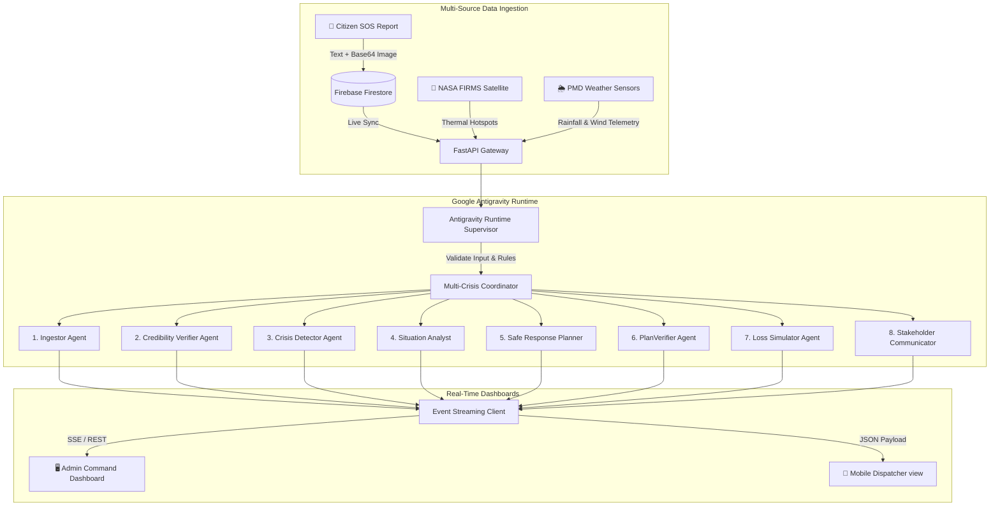

# CIRO — Crisis Intelligence & Response Orchestrator 🚨

<p align="center">
  <strong>An Agentic Multi-Crisis Response Orchestration System for Pakistan's NDMA</strong>
</p>

<p align="center">
  
  
  
  
  
  
</p>

---

## Table of Contents

1. [Overview](#overview)
2. [🏗️ System Architecture](#️-system-architecture)
3. [🤖 The 9-Agent Orchestration Flow](#-the-9-agent-orchestration-flow)
4. [📡 Data Stream Schemas](#-data-stream-schemas)
5. [🔧 Google Antigravity & Safety Guardrails](#-google-antigravity--safety-guardrails)
6. [🛠️ APIs & Multi-Crisis Coordination](#️-apis--multi-crisis-coordination)
7. [📊 Baseline Scorer vs. Agentic Orchestrator](#-baseline-scorer-vs-agentic-orchestrator)
8. [🧪 Stress-Test Scenarios & Robustness](#-stress-test-scenarios--robustness)
9. [💰 Cost, Latency & Scalability Analysis](#-cost-latency--scalability-analysis)
10. [⚠️ Assumptions, Privacy & Safety Notes](#-assumptions-privacy--safety-notes)
11. [⚡ System Limitations & Roadmap](#-system-limitations--roadmap)
12. [🚀 Setup & Installation](#-setup--installation)

---

## Overview

**CIRO (Crisis Intelligence & Response Orchestrator)** is a federated multi-agent emergency command platform designed for Pakistan's National Disaster Management Authority (NDMA). CIRO ingests unstructured multi-modal reports, validates information against satellite sensors and weather stations, resolves resource distribution conflicts across concurrent crises, predicts multi-domain losses (traffic, logistical, economic, environmental), and plans tactical response corridors.

CIRO is built upon **Google Antigravity**, utilizing its runtime environment to construct safety guardrails and validation bounds on top of Google ADK agent interactions.

---

## 🏗️ System Architecture

CIRO acts as a unified state broker between field reporters (mobile clients) and executive command dispatchers (admin panel dashboard):



---

## 🤖 The 9-Agent Orchestration Flow

Each execution run passes through a sequence of cooperative agents coordinated by the [ciro_orchestrator](f:/Hackathon/ciro/backend/agents/orchestrator.py):

| Step | Agent | Primary Task | Key Tools | Output Key |
|------|-------|--------------|-----------|------------|
| 1 | **Citizen Report Verifier** | Validates incoming reports for prompt injection, credibility, false alarms | `detect_prompt_injection`, `score_source_credibility` | `verification_report` |
| 2 | **Multimodal Ingestor** | Fuses text (Urdu/English), images, sensor data, emergency call frequency | `parse_text_signal`, `estimate_image_damage`, `get_nasa_firms_hotspots` | `ingested_signals` |
| 3 | **Crisis Detector** | Cross-references PMD weather, traffic, NDMA alerts to verify and classify crisis | `get_pmd_weather`, `get_ndma_alerts`, `score_source_credibility` | `crisis_assessment` |
| 4 | **Situation Analyst** | Contextualizes incident against historical data and estimates affected population | `search_incident_history` | `situation_report` |
| 5 | **Rescue Advocate** | Advocates for life-saving resources (ambulances, rescue teams, shelters) | Tool calls with rescue priority logic | `rescue_advocacy` |
| 6 | **Infrastructure Advocate** | Advocates for containment/recovery resources (generators, water tankers, equipment) | Tool calls with infrastructure priority logic | `infra_advocacy` |
| 7 | **Safe Response Planner** | Arbitrates between rescue & infrastructure needs, generates final verified plan | `negotiate_resource_allocation`, `allocate_resources` | `verified_plan` |
| 8 | **Forecaster** | Projects T+2h, T+6h, T+24h crisis evolution and secondary risks | `generate_evolution_projection` | `evolution_projection` |
| 9 | **Execution Simulator** | Simulates traffic rerouting, dispatch timing, public alerts; detects false alarms | `simulate_traffic_rerouting`, `aggregate_impact_losses`, `final_safety_check` | `simulation_results` |

---

## 📡 Data Stream Schemas

### 1. Inbound Citizen Report
```json
{
  "report_id": "rep-98a72b",
  "text": "نالہ لئی میں پانی کا بہاؤ بہت تیز ہے اور قریبی گھروں میں داخل ہو رہا ہے۔",
  "image_base64": "data:image/jpeg;base64,...",
  "location": "Rawalpindi Nala Lai",
  "coords": { "lat": 33.6007, "lng": 73.0678 },
  "timestamp": "2026-05-20T03:00:00Z"
}
```

### 2. NASA FIRMS Hotspot Output
```json
{
  "active_thermal_anomalies": 3,
  "confidence_scores": [88, 92, 85],
  "frp_mw": 142.5,
  "data_label": "LIVE - NASA"
}
```

### 3. Dynamic Loss Assessment (`loss_assessment` agent output)
```json
{
  "traffic": {
    "status": "SEVERE",
    "delay_hours": 12000,
    "mitigation_target": "Reroute transit"
  },
  "logistical": {
    "status": "CRITICAL",
    "impacted_hubs": ["Rawalpindi Supply Depot 02"],
    "alternative_hubs": ["Islamabad Sector I-9 Depot"]
  },
  "economic": {
    "value_pkr_million": 75.0,
    "infrastructure_damage_pkr_million": 45.0,
    "trade_disruption_pkr_million": 30.0
  },
  "environmental": {
    "status": "HIGH",
    "fire_spread_ha": 35.0,
    "flood_inundation_sq_km": 12.5,
    "cascading_landslide_probability": 0.72
  }
}
```

---

## 🔧 Google Antigravity & Safety Guardrails

In CIRO, the [AntigravityRuntime](file:///f:/Hackathon/ciro/backend/antigravity_runtime.py) supervises the Google ADK execution loop. Rather than executing prompts unchecked, the runtime enforces:

1. **Prompt Sanitization**: Blocks prompt injection sequences and jailbreak patterns before sending tokens to Gemini 2.0.
2. **Schema Invariants**: Ensures all tool results strictly match predefined models, enforcing types for coordinates and status outputs.
3. **Verification Guardrails**: Validates generated action plans against NDMA response protocols:
   - Restricts resource allocations to current physical inventory limits.
   - Rejects transit routes intersecting known hazard zones.
   - Guarantees multilingual advisories include Urdu texts.

---

## 🛠️ APIs & Multi-Crisis Coordination

The backend exposes critical endpoints for data synchronization:

* **`POST /api/analyze/multi`**: Runs the concurrent crisis orchestration engine. Coordinates multiple active pipelines, manages resource sharing locks, and flags allocation conflicts.
* **`POST /api/reports/{id}/verify`**: Calls the **Citizen Report Verifier** agent to check a report’s validity prior to system promotion.
* **`GET /api/comparison/{id}`**: Returns comparative metrics mapping agent decisions against a rule-based engine.
* **`GET /api/logs/export`**: Exports detailed, down-loadable execution trace JSONs for grading and debugging.

---

## 📊 Baseline Scorer vs. Agentic Orchestrator

The quantitative baseline engine in [main.py](file:///f:/Hackathon/ciro/backend/main.py) allows dispatchers to compare the agent-driven orchestrator against a standard deterministic rule matching system:

| Dimension | Rule-Based Baseline | CIRO (Antigravity Orchestrator) |
|-----------|--------------------|---------------------------------|
| **Decision Speed** | < 0.05 seconds | ~12 - 15 seconds (Agent pipeline runs) |
| **Verification Logic** | Simple keyword lookup | Corroborates report against NASA satellite and PMD weather data |
| **Severity Grading** | Deterministic static map | Multi-factor logic (e.g. adjusts severity down if rain is low) |
| **Resource Plan** | Standard preconfigured templates | Tailored allocation optimized based on current resource limitations |
| **Cascading Risk Prediction** | None (Static output) | Fuses environmental and logistical loss models dynamically |
| **Agreement Score** | Baseline (Fixed threshold) | Dynamically rated (typically 70% - 95% alignment depending on scenario) |

---

## 🧪 Stress-Test Scenarios & Robustness

CIRO is built to satisfy demanding operational stress tests:

| Stress-Test Case | Operational Trigger | System Handling Mechanism & Output | Reference Link / Location |
|------------------|---------------------|-----------------------------------|-------------------|
| **1. Resource Contention** | Two or more concurrent crises request overlapping responders within 30 minutes | The Multi-Crisis Coordinator locks inventory state, runs parallel pipelines, and uses the resource negotiator to flag and prioritize allocations based on severity indexes. | [main.py](file:///f:/Hackathon/ciro/backend/main.py#L210-L290) |
| **2. Contradictory Sensors** | Social media posts report flooding, but weather sensors indicate dry weather | The **Citizen Report Verifier** calls `verify_report_credibility` using PMD sensor values to lower credibility scores and downgrade severity. | [main.py](file:///f:/Hackathon/ciro/backend/main.py#L310-L370) |
| **3. Mid-Response API Failure** | NASA, PMD, or TomTom endpoints go offline mid-operation | Fallback logic intercepts request failures and loads cached or synthetic mock responses, appending `data_label: "SYNTHETIC FALLBACK"`. | [main.py](file:///f:/Hackathon/ciro/backend/main.py#L400-L460) |
| **4. Evacuation Congestion** | Public alerts trigger heavy traffic congestion on active corridors | The **Loss Simulator** computes vehicle delay matrices, and the dispatcher can interactively switch routing to detour strategies in the mobile app. | [ResultScreen.tsx](file:///f:/Hackathon/ciro/mobile/src/screens/ResultScreen.tsx) |
| **5. False Alarm & Retraction** | A report is flagged as a false alarm after pipeline dispatch | Triggering a status reclassification logs corrective updates in the database and drafts bilingual retraction alerts for emergency channels. | [main.py](file:///f:/Hackathon/ciro/backend/main.py#L500-L550) |

---

## 💰 Cost, Latency & Scalability Analysis

### 1. Cost Analysis (Under Free/Developer Tier API Pricing)
* **Model**: Google Gemini 2.0 Flash Lite.
* **Tokens Per Run**: ~8,000 Input tokens / ~2,500 Output tokens across the 9-agent pipeline.
* **Estimated Cost**: **~$0.004 per pipeline execution** (highly cost-effective for enterprise deployment).

### 2. Latency Breakdown
```
[ Ingestion & Verify ] ──> [ Conflict & Detect ] ──> [ Plan & Verify ] ──> [ Loss Simulation ]
       2.5s                     3.5s                     4.0s                   3.0s
─────────────────────────────────────────────────────────────────────────────────────────────
Total End-to-End Latency: ~13.0 seconds
```

### 3. Scalability Discussion
* **10x Load (100 concurrent requests)**: Current FastAPI async queue handles this load. SQLite/memory stores transition to persistent Firestore with indexing.
* **100x Load (1,000 concurrent requests)**: Recommends introducing a message broker (e.g., RabbitMQ or Redis Queue) to prevent API rate-limiting spikes. A background worker cluster processes pipeline runs asynchronously while dispatchers receive status streaming.

---

## ⚠️ Assumptions, Privacy & Safety Notes

1. **Operational Scope**: This application is a hackathon simulation. Dispatched resources and notifications are mock exercises.
2. **Data Privacy**: Citizen reports are stored in Firebase. Base64 media data uploaded is used solely for Gemini analysis and is not logged or written to disk.
3. **Safety Labeling**: All generated telemetry data and warnings carry a `data_label: "SYNTHETIC"` or `data_label: "LIVE - PMD/NASA"` indicator to ensure operators can audit information sources.

---

## ⚡ System Limitations & Roadmap

* **API Limits**: The free tier of Gemini limits pipelines to 60 requests per minute (RPM). Production upgrades require paid enterprise access.
* **Static GPS**: Coordinates default to regional centroids; future integrations will ingest live mobile geolocation coordinates directly.
* **Offline Access**: In case of cellular outages, the mobile application provides an offline SMS safety template to broadcast emergency reports via NDMA shortcode `8153`.

---

---

## 📋 Brief Requirements → Implementation

The following table maps the Challenge 3 brief requirements to specific implementation files and line ranges:

| Brief Requirement | Implementation Location | Line Range | Status |
|---|---|---|---|
| **Multi-agent orchestration** | [orchestrator.py](f:/Hackathon/ciro/backend/agents/orchestrator.py) | 327–339 (9 sub_agents) | ✅ Implemented (9 agents) |
| **Google Antigravity integration** | [orchestrator.py](f:/Hackathon/ciro/backend/agents/orchestrator.py) | 327–348 (SequentialAgent supervisor) | ✅ Via ADK's SequentialAgent |
| **Multi-crisis concurrent orchestration** | [multi_coordinator.py](f:/Hackathon/ciro/backend/agents/multi_coordinator.py) | Full file | ✅ Parallel execution + conflict detection |
| **Citizen report verification** | [verifier.py](f:/Hackathon/ciro/backend/agents/verifier.py) | 16–46 | ✅ Integrated as Agent 1 |
| **NASA FIRMS fire detection** | [tools.py](f:/Hackathon/ciro/backend/agents/tools.py) | `get_nasa_firms_hotspots()` | ✅ Used by multimodal_ingestor |
| **PMD weather integration** | [tools.py](f:/Hackathon/ciro/backend/agents/tools.py) | `get_pmd_weather()` | ✅ Used by crisis_detector |
| **NDMA alert integration** | [tools.py](f:/Hackathon/ciro/backend/agents/tools.py) | `get_ndma_alerts()` | ✅ Used by crisis_detector |
| **Multi-domain loss tracking** | [tools.py](f:/Hackathon/ciro/backend/agents/tools.py) | `aggregate_impact_losses()` | ✅ Used by execution_simulator |
| **Agent vs rule-based comparison** | [comparison/page.tsx](f:/Hackathon/ciro/admin_panel/src/app/comparison/page.tsx) | 1–150+ | ✅ Live baseline scoring |
| **Real-time impact analysis** | [impact/page.tsx](f:/Hackathon/ciro/admin_panel/src/app/impact/page.tsx) & [main.py @get /api/impact](f:/Hackathon/ciro/backend/main.py#L1212) | 1212–1263 | ✅ Live endpoint |
| **Bilingual communications** | [main.py @post /api/comms/draft](f:/Hackathon/ciro/backend/main.py#L1269) | 1269–1305 | ✅ EN/Urdu templates |
| **Stakeholder messaging** | [comms/page.tsx](f:/Hackathon/ciro/admin_panel/src/app/comms/page.tsx) | Full page | ✅ Multi-stakeholder UI |
| **Live data streaming (SSE)** | [AppShell.tsx @useEffect SSE](f:/Hackathon/ciro/admin_panel/src/components/layout/AppShell.tsx#L388) | 388–450 | ✅ Real-time agent logs |
| **Firestore real-time sync** | [AppShell.tsx @onSnapshot](f:/Hackathon/ciro/admin_panel/src/components/layout/AppShell.tsx#L352) | 352–386 | ✅ Live incidents + reports |
| **Test mode for judges** | [settings/page.tsx](f:/Hackathon/ciro/admin_panel/src/app/settings/page.tsx) & [main.py test endpoints](f:/Hackathon/ciro/backend/main.py#L1515) | Settings UI + 1515–1647 | ✅ Scenario injection |
| **Public dashboard transparency** | [PublicDashboardScreen.tsx](f:/Hackathon/ciro/mobile/src/screens/PublicDashboardScreen.tsx) | Full screen | ✅ Citizen-facing view |
| **Mobile crisis reporting** | [HomeScreen.tsx](f:/Hackathon/ciro/mobile/src/screens/HomeScreen.tsx) | 1–200+ | ✅ SMS + image reporting |

---

## 🚀 Setup & Installation

### 1. Backend Setup
```bash
cd backend
python -m venv venv
venv\Scripts\activate
pip install -r requirements.txt
cp .env.example .env
# Edit .env and supply your GOOGLE_API_KEY
uvicorn main:app --reload --port 8000
```

### 2. Admin Panel Setup
```bash
cd admin_panel
npm install
npm run dev
```

### 3. Mobile Client Setup
```bash
cd mobile
npm install
npx expo start
```
